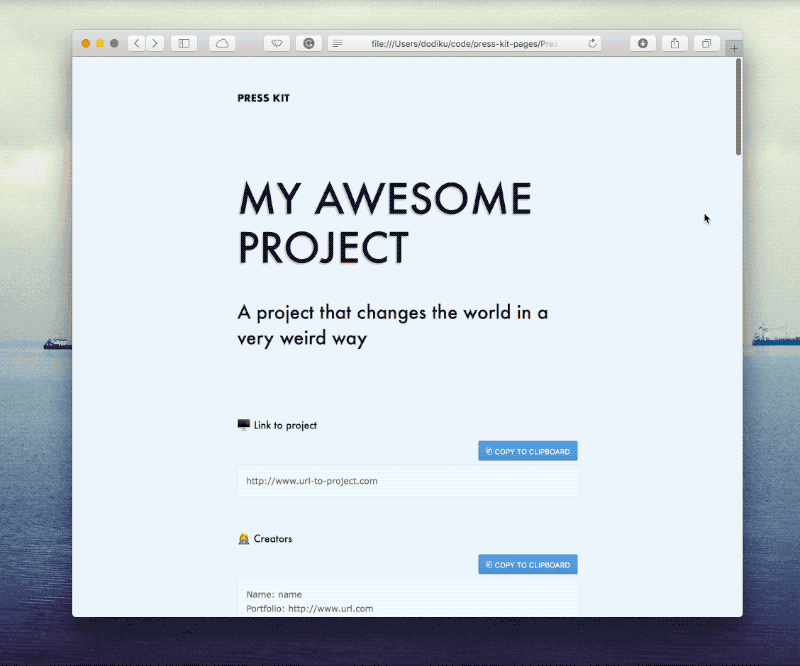

[](https://github.com/Naereen/StrapDown.js/blob/master/LICENSE)
# PressKit.js

``PressKit.js`` generates a fancy press kit for your project!
If you want to put your project out there and to expose it to more people like yourself, creating good documentation -- photos, gifs, videos -- is the best way to communicate your ideas.

This is where ``PressKit.js`` comes handy 🙌! Collect all your media and textual information, and create a nice project press kit page to make it easier for the popular media to cover your work in a more appealing way!



### Example Page
See example page on -
>  [dodiku.github.io/presskit.js/](https://dodiku.github.io/PressKit.js/)

### How to use
It's extremely simple:
1. In ``press.html``, find the ``projectDetails`` object (see example below). using your favorite text editor.
2. Replace the placeholders with text about your project and with URLs to media files.
3. Add a link to ``press.html`` on your project home page.

```javascript
var projectDetails = {

  'title': 'project name', // the title of the project

  'subTitle': 'project subtitle', // the subtitle of the project

  'link': 'http://www.url.com', // link to the project landig page

  'creators': [ // supports multiple creators. just add more objects to the array

    {
      'name': 'name',
      'portfolio': 'http://www.url.com',
      'email': 'a@b.com',
      'twitter': 'http://www.twitter.com/name'
    },

    {
      'name': 'name',
      'portfolio': 'http://www.url.com',
      'email': 'a@b.com',
      'twitter': 'http://www.twitter.com/name'
    },

  ],

  'about': [

    'paragraph 01',

    'paragraph 02',
  ],

  'videos': [ // supports multiple videos. just add more objects to the array

    {
      'embedUrl': 'http://www.url.com', // e.g. https://www.youtube.com/embed/GjYENsrLLf4
      'videoPage': 'http://www.url.com', // e.g. https://www.youtube.com/watch?v=GjYENsrLLf4
    },

  ],

  'gifs': [ // supports multiple gifs. just add more objects to the array

    {
      'gifUrl': 'http://www.url.com',
      'gifDowloadUrl': 'http://www.url.com', // could be the same as gifUrl
    },

  ],

  'photos': [ // supports multiple photos. just add more objects to the array

    {
      'photoUrl': 'http://www.url.com',
      'photoDowloadUrl': 'http://www.url.com', // could be the same as photoUrl
    },

  ],

}
```
